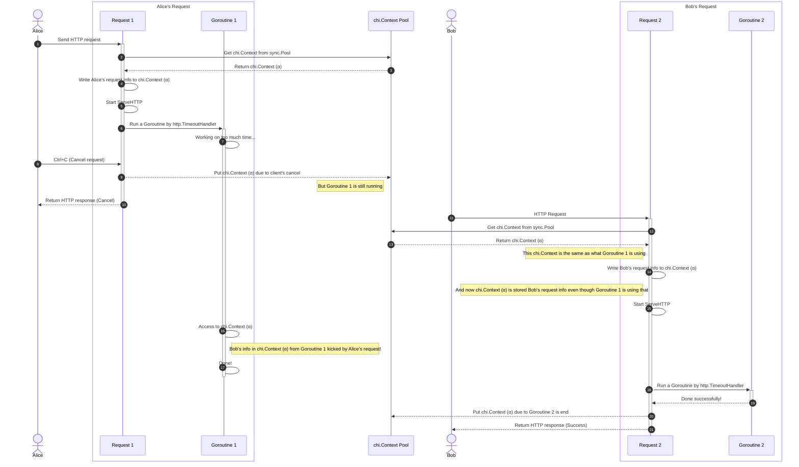

go-chi `Context` leak to the other request with `http.TimeoutHandler`?
========================================================================

Demo: https://www.youtube.com/watch?v=RTQPUjnO2xQ

```mermaid
sequenceDiagram
    autonumber
    actor Alice

    box Alice's Request
    participant R1 as Request 1
    participant G1 as Goroutine 1
    end

    participant Ctx as chi.Context Pool

    actor Bob

    box Bob's Request
    participant R2 as Request 2
    participant G2 as Goroutine 2
    end

    Alice ->>+ R1: Send HTTP request
    R1 ->> Ctx: Get chi.Context from sync.Pool
    Ctx -->> R1: Return chi.Context (α)
    R1 -> R1: Write Alice's request info to chi.Context (α)
    
    R1 -> R1: Start ServeHTTP
    R1 ->>+ G1: Run a Goroutine by http.TimeoutHandler
    G1 -> G1: Working on too much time...
    Alice ->> R1: Ctrl+C (Cancel request)
    R1 -->> Ctx: Put chi.Context (α) due to client's cancel
    Note left of Ctx: But Goroutine 1 is still running
    R1 -->>- Alice: Return HTTP response (Cancel)

    Bob ->>+ R2: HTTP Request
    R2 ->> Ctx: Get chi.Context from sync.Pool
    Ctx -->> R2: Return chi.Context (α)
    Note left of R2: This chi.Context is the same as what Goroutine 1 is using
    R2 -> R2: Write Bob's request info to chi.Context (α)
    Note left of R2: And now chi.Context (α) is stored Bob's request info even though Goroutine 1 is using that
    R2 -> R2: Start ServeHTTP

    G1 -> G1: Access to chi.Context (α)
    Note right of G1: Bob's info in chi.Context (α) from Goroutine 1 kicked by Alice's request!
    G1 ->- G1: Done!

    R2 ->>+ G2: Run a Goroutine by http.TimeoutHandler
    G2 -->>- R2: Done successfully!
    R2 -->> Ctx: Put chi.Context (α) due to Goroutine 2 is end
    R2 -->>- Bob: Return HTTP response (Success)
```
